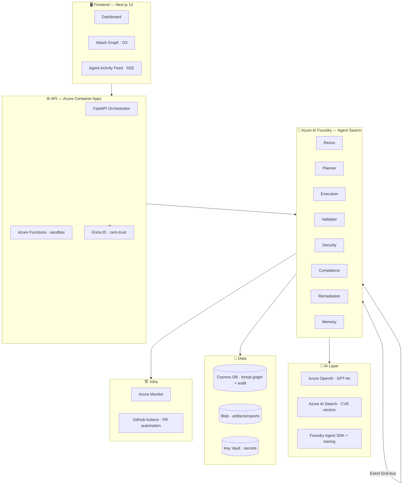

<div align="center">

# 🛡️ BreachSim — Agentic Red Team Swarm

**"Attackers don't sleep. Now neither does your red team."**

An autonomous agent swarm that continuously probes your cloud posture and writes its own
attack playbooks — *before real attackers do.*

[](https://azure.microsoft.com/products/ai-foundry)
[](https://www.python.org/)
[](https://nextjs.org/)
[](LICENSE)
[](#)

</div>

---

## Table of Contents

1. [Overview](#overview)
2. [The Problem](#the-problem)
3. [The Solution](#the-solution)
4. [Architecture](#architecture)
5. [Tech Stack](#tech-stack)
6. [Microsoft Services Used](#microsoft-services-used)
7. [AI Components](#ai-components)
8. [Installation](#installation)
9. [Deployment](#deployment)
10. [Repository Structure](#repository-structure)
11. [Documentation Index](#documentation-index)
12. [Future Work](#future-work)
13. [Team Roles](#team-roles)

---

## Overview

**BreachSim** is the world's first AI-native adversarial simulation platform. Autonomous agent
swarms continuously red-team your cloud infrastructure, *reason* over novel attack paths, and
close the vulnerability loop with auto-generated remediation code — turning offensive security
from a quarterly ritual into a **continuous intelligence system**.

Unlike static DAST scanners, BreachSim deploys a swarm of specialized agents that **discover →
chain → exploit → validate → report → remediate** in real time, sharing a collective threat
memory through Azure Cosmos DB.

> **Demo wow-factor:** Spin up a misconfigured blob storage and watch 5+ agents discover, chain,
> exploit, report, and remediate a threat vector in **under 90 seconds** — live on screen.

---

## The Problem

- **Security teams can't red-team fast enough.** New cloud configs ship hourly; manual pen-testing
  happens quarterly at best.
- **DAST tools are static scanners.** They don't reason, chain exploits, or adapt to novel
  configurations.
- **No tool autonomously discovers, chains, and remediates** threat vectors in real time.
- CISOs pay **$200K+/yr** for red-team retainers against a **$15B+** cybersecurity testing market.

---

## The Solution

A **multi-agent swarm** with genuine agent-to-agent collaboration:

| Agent | Role |
|-------|------|
| **Recon Agent** | Maps the attack surface (resources, configs, identities). |
| **Planner Agent** | Reasons over a CVE/attack graph to compose exploit chains. |
| **Execution Agent** | Crafts and runs sandboxed payloads in Azure Functions. |
| **Validator Agent** | Confirms exploitability and assigns true risk severity. |
| **Security Agent** | Enforces scope/guardrails; can veto unsafe actions. |
| **Compliance Agent** | Generates NIST 800-53 / SOC 2 / ISO 27001 evidence. |
| **Remediation Agent** | Emits Bicep/Terraform IaC fixes + opens a GitHub PR. |
| **Memory Agent** | Persists and recalls the shared threat graph. |

Agents communicate **asynchronously over Azure Event Grid** and share a **threat memory** in
Cosmos DB. This mirrors how elite red teams actually operate — distinct roles, distinct tool
access, and a chain-of-custody audit trail for every action.

See [docs/multi-agent-design.md](docs/multi-agent-design.md) for full specs.

---

## Architecture



Full detail: [docs/architecture.md](docs/architecture.md).

---

## Tech Stack

| Layer | Technology |
|-------|-----------|
| **Frontend** | Next.js 14 (App Router), TypeScript, Tailwind CSS, D3.js, Server-Sent Events |
| **Backend** | Python 3.11, FastAPI, Pydantic v2, Uvicorn |
| **Agents** | Azure AI Foundry Agent SDK, Semantic Kernel orchestration |
| **AI** | Azure OpenAI (GPT-4o), Azure AI Search (vector CVE index) |
| **Database** | Azure Cosmos DB (NoSQL, Gremlin-style threat graph) |
| **Messaging** | Azure Event Grid (agent message bus) |
| **Compute** | Azure Container Apps, Azure Functions |
| **Auth** | Microsoft Entra ID (OAuth2 / OIDC, tenant consent) |
| **Secrets** | Azure Key Vault |
| **Observability** | Azure Monitor, Application Insights, Foundry tracing |
| **IaC / CI/CD** | Bicep, Azure Developer CLI (`azd`), GitHub Actions |

---

## Microsoft Services Used

- **Azure AI Foundry** — agent orchestration, SDK, and tracing
- **Azure OpenAI** — GPT-4o reasoning for attack planning
- **Azure AI Search** — vector index of CVE knowledge base
- **Azure Cosmos DB** — threat graph + immutable audit log
- **Azure Functions** — sandboxed payload execution
- **Azure Container Apps** — auto-scaling agent hosting
- **Azure Event Grid** — asynchronous agent message bus
- **Azure Monitor / App Insights** — observability + alerting
- **Microsoft Entra ID** — zero-trust authn/authz + tenant consent
- **Azure Key Vault** — secret + credential storage

---

## AI Components

1. **Reasoning-native attack planning** — GPT-4o dynamically composes attack chains from novel
   environmental context (no pre-built attack trees).
2. **RAG over CVE corpus** — Azure AI Search vector index grounds the Planner Agent in real CVEs.
3. **Multi-agent specialization** — distinct roles, tool access, and async communication.
4. **Shared threat memory** — Cosmos DB persists discovered paths so agents learn across runs.
5. **Compliance-native output** — every action is mapped to NIST/SOC2/ISO controls.

---

## Installation

### Prerequisites

- Python **3.11+**, Node.js **20+**, Docker, Azure CLI, Azure Developer CLI (`azd`)
- An Azure subscription with access to Azure OpenAI

### Local setup

```bash
git clone https://github.com/<org>/breachsim.git
cd breachsim

# Backend
cd backend
python -m venv .venv && source .venv/bin/activate
pip install -r requirements.txt
cp ../.env.example .env          # fill in values
uvicorn app.main:app --reload --port 8000

# Frontend (new terminal)
cd ../frontend
npm install
cp .env.local.example .env.local
npm run dev                      # http://localhost:3000
```

See [docs/deployment-guide.md](docs/deployment-guide.md) for the full guide.

---

## Deployment

One command provisions every Azure resource and deploys both apps:

```bash
azd auth login
azd up
```

This runs the Bicep templates in [infra/](infra/) and the GitHub Actions pipeline in
[.github/workflows/deploy.yml](.github/workflows/deploy.yml).

---

## Repository Structure

```
breachsim/
├── backend/        # FastAPI orchestrator + agent swarm (Python)
├── frontend/       # Next.js 14 dashboard (TypeScript + Tailwind)
├── infra/          # Bicep IaC + azd config
├── docs/           # Architecture, design, deck, demo script
├── scripts/        # Demo seeding + helper scripts
└── .github/        # CI/CD workflows
```

---

## Documentation Index

| Document | Purpose |
|----------|---------|
| [docs/architecture.md](docs/architecture.md) | Enterprise architecture (all layers) |
| [docs/uniqueness-moat-report.md](docs/uniqueness-moat-report.md) | Competitive analysis + 5 moats |
| [docs/product-creation.md](docs/product-creation.md) | Vision, pitch, personas, features, roadmap |
| [docs/multi-agent-design.md](docs/multi-agent-design.md) | Agent specs + comms protocol |
| [docs/database-design.md](docs/database-design.md) | ER diagram, tables, indexes, data flow |
| [docs/api-design.md](docs/api-design.md) | Full REST API specification |
| [docs/build-plan.md](docs/build-plan.md) | 4-phase build plan with estimates |
| [docs/ui-ux.md](docs/ui-ux.md) | Pages, flows, wireframes, color system |
| [docs/demo-script.md](docs/demo-script.md) | 3-minute scene-by-scene demo script |
| [docs/pitch-deck.md](docs/pitch-deck.md) | 10-slide deck with speaker notes |

---

## Future Work

- **Multi-cloud**: AWS + GCP swarm support
- **24/7 continuous mode** with scheduled swarms
- **Custom attack scenario builder**
- **Red team vs. blue team** simulation mode
- **Microsoft Sentinel** SOC analyst co-pilot integration

---

## Team Roles

| Role | Responsibility |
|------|----------------|
| **Product / PM** | Vision, personas, demo narrative, pitch |
| **Agent / AI Engineer** | Foundry agents, prompts, orchestration, RAG |
| **Backend Engineer** | FastAPI, Cosmos DB, Event Grid, Functions |
| **Frontend Engineer** | Next.js dashboard, attack graph, SSE feed |
| **Cloud / DevOps Engineer** | Bicep IaC, Entra ID, CI/CD, observability |

---

<div align="center">

Built for the **"Security in the Agentic Future"** theme.

</div>
