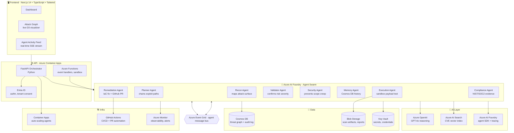
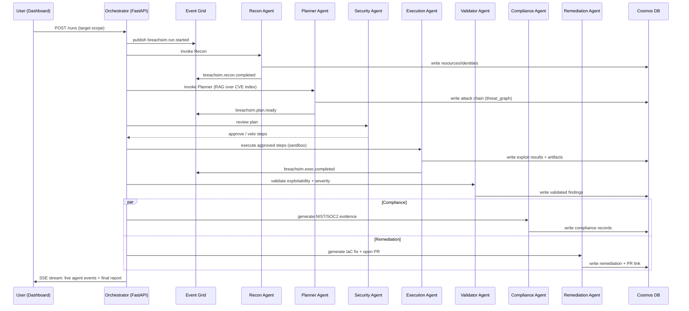

# BreachSim — Enterprise Technical Architecture

> Theme: **Security in the Agentic Future**
> Status: Hackathon reference architecture (production-ready design)

This document defines the end-to-end, enterprise-grade architecture across every layer. It is
deliberately Microsoft-stack-heavy.

---

## 1. Architecture at a glance

---

## 2. Layer-by-layer design

### 2.1 Frontend

| Concern | Choice | Rationale |
|---------|--------|-----------|
| Framework | **Next.js 14 (App Router)** | SSR + RSC, edge-ready, great DX |
| Language | **TypeScript** | Type safety across API contracts |
| Styling | **Tailwind CSS** + shadcn/ui | Fast, consistent design system |
| Real-time | **Server-Sent Events (SSE)** | One-way agent feed; simpler than WS |
| Visualization | **D3.js** force-directed graph | Live attack-graph rendering |
| State | **TanStack Query** + Zustand | Server cache + ephemeral UI state |
| Auth | **MSAL.js** (Entra ID) | Native Microsoft identity |

Three core surfaces: **Dashboard**, **Attack Graph**, **Agent Activity Feed** (see
[ui-ux.md](ui-ux.md)).

### 2.2 Backend / API

- **FastAPI orchestrator** on **Azure Container Apps** — exposes REST + SSE, owns swarm lifecycle.
- **Azure Functions** — event-driven handlers (Event Grid triggers) and the **sandboxed
  execution** surface for the Execution Agent. Functions run in an isolated, network-restricted
  plan with no outbound access to production resources.
- **Pydantic v2** models enforce request/response contracts (see [api-design.md](api-design.md)).
- **Async-first**: all I/O (Cosmos, OpenAI, Event Grid) uses async SDKs.

### 2.3 Database — Cosmos DB

- **NoSQL API** for documents (findings, agent events, audit log).
- **Threat graph** modeled as nodes + edges documents (resource → vulnerability → exploit-step).
- Partitioning by `runId` for hot-path locality; TTL on ephemeral agent events.
- **Immutable audit container** (append-only, change-feed enabled) for compliance evidence.
- Detail: [database-design.md](database-design.md).

### 2.4 Vector Store — Azure AI Search

- Vector + hybrid (BM25 + ANN) index over a **CVE/CWE/ATT&CK corpus**.
- Embeddings via **Azure OpenAI `text-embedding-3-large`**.
- Powers RAG for the **Planner Agent** so attack chains are grounded in real CVEs.
- Semantic ranker enabled for high-precision retrieval.

### 2.5 Authentication — Microsoft Entra ID

- **Zero-trust**: every request carries an Entra-issued JWT; validated against `ENTRA_API_AUDIENCE`.
- **Tenant consent flow**: customers grant a scoped, time-boxed app registration that lets the
  swarm enumerate their resources (read-only by default; write only for sandbox + remediation PRs).
- **Managed Identity** for all service-to-service auth (no secrets in code).
- **RBAC**: least-privilege custom roles per agent (Recon = Reader; Remediation = PR-only).

### 2.6 Agent Framework — Azure AI Foundry

- Each agent is a **Foundry Agent** with its own system prompt, tool allow-list, and model config.
- **Distinct tool access per agent** (Recon cannot call exploit tools; Validator can veto).
- Built-in **tracing** exports spans to Application Insights.

### 2.7 Orchestration Layer

- **Semantic Kernel** group-chat / handoff orchestration wraps the Foundry agents.
- The **Orchestrator** (FastAPI service) drives the run state machine:
  `RECON → PLAN → EXECUTE → VALIDATE → (COMPLIANCE ∥ REMEDIATION) → REPORT`.
- Agents emit events to **Event Grid**; the orchestrator subscribes and advances state.
- Supports **parallel fan-out** (Compliance + Remediation run concurrently after Validation).

### 2.8 Memory Layer

- **Short-term**: per-run working memory held in the orchestrator + Cosmos `threat_graph`.
- **Long-term**: cross-run **threat memory** in Cosmos — discovered paths, prior findings, and
  environment fingerprints. The **Memory Agent** reads/writes this so the swarm *learns*.
- **Semantic recall**: relevant prior findings retrieved via embeddings before planning.

### 2.9 Observability

- **Azure Monitor + Application Insights** — distributed traces across agent hops.
- **Foundry tracing** — per-agent token usage, latency, tool calls.
- **Structured logging** (JSON) with `runId`/`agentId` correlation IDs.
- **Dashboards + alerts**: run failures, guardrail violations, cost anomalies.

### 2.10 Security

- `BREACHSIM_SANDBOX_ONLY` hard guardrail — Execution Agent payloads only ever hit sandbox
  resources provisioned for the run.
- **Security Agent** enforces scope (subscription allow-list, blast-radius limits) and can **veto**
  any planned step before execution.
- **Key Vault** for all secrets; **Managed Identity** everywhere.
- **Network isolation**: Functions sandbox in a dedicated VNet with no prod peering.
- **Immutable audit trail** + control mappings for NIST 800-53 / SOC 2 / ISO 27001.

### 2.11 Deployment

- **Bicep** modules provision every resource (`infra/`).
- **Azure Developer CLI (`azd up`)** for one-command provision + deploy.
- **GitHub Actions** for CI (lint/test) and CD (build containers → push to ACR → deploy ACA).
- **Container Apps** revisions enable blue/green + auto-scale (KEDA on queue depth).

---

## 3. Run lifecycle (sequence)

---

## 4. Non-functional requirements

| NFR | Target |
|-----|--------|
| Demo run latency | < 90 s end-to-end (seeded sandbox) |
| Concurrent runs | 50+ (Container Apps auto-scale) |
| Agent event latency | < 500 ms (Event Grid) |
| Availability | 99.9% (multi-replica ACA) |
| Audit retention | 7 years (Cosmos + Blob cold tier) |
| Cost guardrail | Per-run token budget enforced by orchestrator |

---

## 5. Why this architecture wins

- **Genuinely agentic**: async Event Grid messaging, not sequential LLM calls.
- **Deep Microsoft integration**: Foundry, Entra ID, Container Apps, Event Grid, Cosmos, Monitor.
- **Self-contained, controllable demo**: sandbox provisioned per run → 90-second wow.
- **Closes the loop**: red-team → blue-team remediation PR, fully automated.
