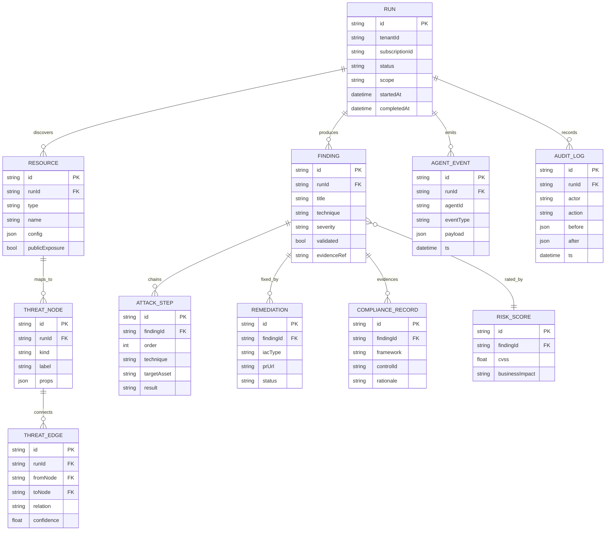
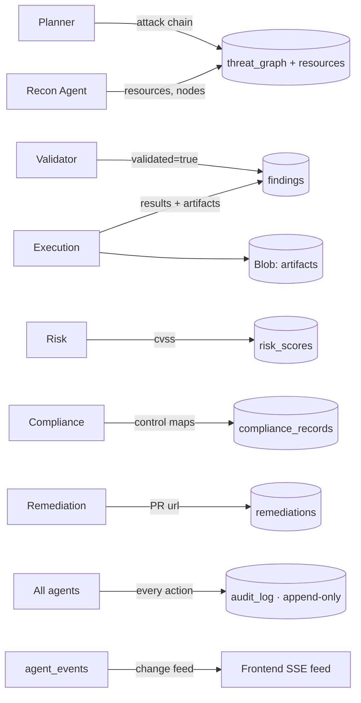

# BreachSim — Database Design (Cosmos DB)

BreachSim uses **Azure Cosmos DB for NoSQL**. Documents are partitioned by `runId` for hot-path
locality. The threat graph is modeled as node + edge documents within a container. An append-only
audit container (change-feed enabled) backs compliance evidence.

---

## 1. ER diagram



---

## 2. Containers (tables)

| Container | Partition key | Purpose | TTL |
|-----------|--------------|---------|-----|
| `runs` | `/tenantId` | Run metadata + status | none |
| `resources` | `/runId` | Discovered cloud resources | 30d |
| `threat_graph` | `/runId` | Node + edge docs (`kind` discriminates) | 90d |
| `findings` | `/runId` | Validated findings + attack steps | none |
| `risk_scores` | `/runId` | Severity / business impact | none |
| `compliance_records` | `/runId` | Control-mapped evidence | none (7y archive) |
| `remediations` | `/runId` | IaC fixes + PR links | none |
| `agent_events` | `/runId` | Agent event stream (SSE source) | 7d |
| `audit_log` | `/runId` | **Append-only** chain of custody | none (immutable) |

---

## 3. Representative document schemas

### `findings`
```json
{
  "id": "find_01",
  "runId": "run_abc",
  "tenantId": "tnt_1",
  "title": "Public blob with anonymous read → secrets exposure",
  "technique": "T1530",
  "attackSteps": [
    { "order": 1, "technique": "T1595", "targetAsset": "stbreachdemo", "result": "public endpoint found" },
    { "order": 2, "technique": "T1530", "targetAsset": "container:configs", "result": "downloaded appsettings.json" }
  ],
  "severity": "critical",
  "validated": true,
  "evidenceRef": "blob://artifacts/run_abc/find_01.json",
  "createdAt": "2026-06-10T12:01:30Z"
}
```

### `threat_graph` (node)
```json
{ "id": "node_blob1", "runId": "run_abc", "kind": "node",
  "nodeKind": "resource", "label": "stbreachdemo", "props": { "publicExposure": true } }
```

### `threat_graph` (edge)
```json
{ "id": "edge_1", "runId": "run_abc", "kind": "edge",
  "fromNode": "node_internet", "toNode": "node_blob1", "relation": "reaches", "confidence": 0.94 }
```

### `audit_log` (immutable)
```json
{ "id": "aud_1", "runId": "run_abc", "actor": "execution-agent",
  "action": "sandbox_payload_run", "before": null,
  "after": { "step": 2, "result": "success" }, "ts": "2026-06-10T12:01:28Z" }
```

---

## 4. Indexing policy

- **Default**: automatic indexing on all paths.
- **Composite indexes**:
  - `findings`: `(/runId ASC, /severity DESC)` — dashboard sort.
  - `agent_events`: `(/runId ASC, /ts ASC)` — ordered SSE replay.
  - `threat_graph`: `(/runId ASC, /kind ASC)` — fast node/edge split.
- **Excluded paths**: large `props/*` and `payload/*` blobs excluded from indexing to cut RU cost.
- **Change feed**: enabled on `agent_events` (drives SSE) and `audit_log` (compliance pipeline).

---

## 5. Relationships

- `runs (1) → (N) resources | findings | agent_events | audit_log` via `runId`.
- `findings (1) → (N) attack_steps` (embedded array) and `(1) → (1) risk_score`.
- `findings (1) → (N) compliance_records | remediations` via `findingId`.
- `threat_graph` edges reference node ids within the same `runId` partition.

---

## 6. Data flow



**Hot path:** agents write to `agent_events`; Cosmos change feed pushes to the orchestrator, which
fans out to connected dashboards via SSE — sub-second live updates.
