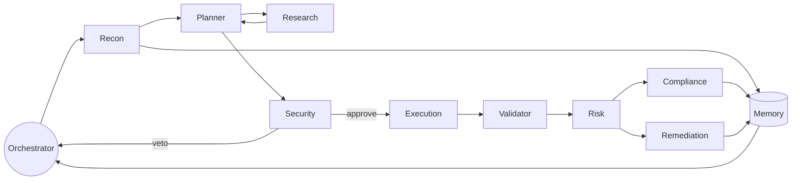

# BreachSim — Multi-Agent Swarm Design

This document specifies the agent swarm: each agent's inputs, outputs, system prompt, tools, and
the inter-agent communication protocol. It also explains why a swarm beats a single agent.

---

## 1. Swarm topology



State machine: `RECON → PLAN → SECURITY_REVIEW → EXECUTE → VALIDATE → RISK → (COMPLIANCE ∥ REMEDIATION) → REPORT`.

---

## 2. Communication protocol

Agents do **not** call each other directly. They publish typed events to **Azure Event Grid**; the
orchestrator subscribes, advances the state machine, and invokes the next agent. This gives
async, auditable, replayable messaging.

### Event envelope (CloudEvents 1.0)

```json
{
  "id": "evt_01H...",
  "source": "breachsim/agents/recon",
  "type": "breachsim.recon.completed",
  "subject": "runs/{runId}",
  "time": "2026-06-10T12:00:00Z",
  "datacontenttype": "application/json",
  "data": {
    "runId": "run_abc",
    "agentId": "recon",
    "status": "success",
    "artifactRef": "cosmos://threat_graph/run_abc",
    "summary": "12 resources, 3 public endpoints, 1 over-privileged identity"
  }
}
```

### Event type catalog

| Event type | Emitted by | Consumed by |
|-----------|-----------|-------------|
| `breachsim.run.started` | Orchestrator | All |
| `breachsim.recon.completed` | Recon | Planner, Memory |
| `breachsim.research.completed` | Research | Planner |
| `breachsim.plan.ready` | Planner | Security |
| `breachsim.security.approved` / `.vetoed` | Security | Execution / Orchestrator |
| `breachsim.exec.completed` | Execution | Validator |
| `breachsim.validation.completed` | Validator | Risk |
| `breachsim.risk.scored` | Risk | Compliance, Remediation |
| `breachsim.compliance.generated` | Compliance | Memory |
| `breachsim.remediation.opened` | Remediation | Memory |
| `breachsim.run.completed` | Orchestrator | Frontend (SSE) |

---

## 3. Agent specifications

> Every agent shares a common contract: it receives a typed input, calls only its allow-listed
> tools, writes results to Cosmos DB, and emits a completion event. Each runs as an **Azure AI
> Foundry agent** with GPT-4o.

### 3.1 Planner Agent
- **Inputs:** Recon findings (resources, identities, exposure), retrieved CVE/ATT&CK context.
- **Outputs:** Ordered **attack chain** (steps with technique IDs, prerequisites, target asset).
- **Tools:** `search_cve_index`, `query_threat_graph`, `get_recon_findings`.
- **System prompt:**
  > You are the Planner Agent of an authorized red-team swarm operating ONLY in a consented
  > sandbox. Given the reconnaissance of the target environment and grounded CVE context,
  > compose the most plausible multi-step attack chain an elite adversary would attempt. Output a
  > strict JSON list of steps; each step has `technique` (MITRE ATT&CK ID), `target_asset`,
  > `precondition`, `expected_effect`, and `confidence` (0-1). Prefer chains that escalate
  > privilege or reach sensitive data. Never propose actions outside the provided scope.

### 3.2 Research Agent
- **Inputs:** Planner queries about specific CVEs/techniques.
- **Outputs:** Grounded summaries (CVE details, exploit prerequisites, references).
- **Tools:** `search_cve_index` (Azure AI Search vector + semantic), `fetch_kb_doc`.
- **System prompt:**
  > You are the Research Agent. Retrieve and synthesize authoritative CVE/CWE/ATT&CK context for
  > the requested technique. Cite source IDs. Never speculate beyond retrieved evidence.

### 3.3 Reasoning Agent *(embedded in Planner via GPT-4o)*
- Provides the chain-of-thought composition; surfaced as the Planner's reasoning trace for the UI.

### 3.4 Execution Agent
- **Inputs:** Security-approved attack steps.
- **Outputs:** Per-step execution results (success/fail, evidence artifact refs).
- **Tools:** `run_sandbox_payload` (Azure Functions, network-isolated), `collect_artifact`.
- **Guardrail:** Refuses any step not present in the approved plan or outside the sandbox.
- **System prompt:**
  > You are the Execution Agent operating in a hard sandbox. Execute ONLY the explicitly approved
  > steps via the sandbox tool. Capture evidence for each. If a tool indicates an out-of-scope
  > target, abort and emit a guardrail violation. You never improvise new steps.

### 3.5 Security Agent
- **Inputs:** Proposed plan from Planner.
- **Outputs:** Per-step `approve`/`veto` with reason; enforces scope + blast radius.
- **Tools:** `check_scope` (subscription allow-list), `estimate_blast_radius`.
- **System prompt:**
  > You are the Security Agent — the swarm's safety brake. Review each proposed step against the
  > consented scope and blast-radius limits. Veto anything touching out-of-scope subscriptions,
  > production data, or destructive operations. Your veto is final.

### 3.6 Validator Agent
- **Inputs:** Execution results.
- **Outputs:** Confirmed exploitability (true/false), reproduction notes, evidence quality score.
- **Tools:** `query_threat_graph`, `verify_artifact`.
- **System prompt:**
  > You are the Validator Agent. Independently confirm whether each executed step truly
  > demonstrates the claimed vulnerability. Reject unproven claims. Output a verdict and a concise
  > reproduction summary.

### 3.7 Risk Agent
- **Inputs:** Validated findings + asset context.
- **Outputs:** CVSS-style severity, business-impact rating, prioritized finding list.
- **Tools:** `score_cvss`, `lookup_asset_criticality`.
- **System prompt:**
  > You are the Risk Agent. Assign severity and business impact to each validated finding, factoring
  > asset criticality and exploit chain depth. Output prioritized JSON.

### 3.8 Compliance Agent
- **Inputs:** Validated, risk-scored findings + audit log.
- **Outputs:** NIST 800-53 / SOC 2 CC6-CC7 / ISO 27001 control-mapped evidence records.
- **Tools:** `map_controls`, `render_evidence`.
- **System prompt:**
  > You are the Compliance Agent. Map each finding and its remediation to relevant NIST 800-53,
  > SOC 2, and ISO 27001 controls. Produce audit-ready evidence with control IDs and rationale.

### 3.9 Remediation Agent
- **Inputs:** Validated findings (especially misconfigurations).
- **Outputs:** IaC fix (Bicep/Terraform) + a GitHub Pull Request.
- **Tools:** `generate_iac_fix`, `open_github_pr`.
- **System prompt:**
  > You are the Remediation Agent. For each finding, generate a minimal, correct Infrastructure-as-
  > Code fix and open a GitHub PR with a clear description, the affected resource, and the control
  > it satisfies. Prefer least-privilege, secure-by-default configurations.

### 3.10 Memory Agent
- **Inputs:** Completed run artifacts and prior-run context.
- **Outputs:** Persisted threat memory; semantic recall of relevant prior findings.
- **Tools:** `write_threat_memory`, `recall_similar_findings` (embeddings).
- **System prompt:**
  > You are the Memory Agent. Persist this run's discoveries to the shared threat memory and, on
  > request, recall semantically similar prior findings to accelerate future planning.

---

## 4. Tool / access matrix (least privilege)

| Agent | search_cve | sandbox_exec | github_pr | threat_graph_write | scope_check |
|-------|:---------:|:------------:|:---------:|:------------------:|:-----------:|
| Recon | – | – | – | ✅ | – |
| Research | ✅ | – | – | – | – |
| Planner | ✅ | – | – | ✅ | – |
| Security | – | – | – | – | ✅ |
| Execution | – | ✅ | – | ✅ | – |
| Validator | ✅ | – | – | ✅ | – |
| Risk | – | – | – | ✅ | – |
| Compliance | – | – | – | ✅ | – |
| Remediation | – | – | ✅ | ✅ | – |
| Memory | ✅ | – | – | ✅ | – |

The strict separation (e.g., Recon ✗ sandbox_exec, Execution ✗ github_pr) is itself a security
control and a differentiator (Moat 2).

---

## 5. Why multiple agents outperform a single agent

1. **Separation of duties = safety.** A single agent that can both plan and execute is one prompt
   injection away from disaster. Splitting planning, approval (Security veto), and execution
   creates defense-in-depth.
2. **Specialized prompts beat one mega-prompt.** Narrow, role-specific system prompts produce
   higher-quality, more reliable outputs than a single overloaded context.
3. **Independent validation.** The Validator independently confirms the Execution Agent's claims,
   reducing hallucinated "vulnerabilities."
4. **Parallelism.** Compliance and Remediation run concurrently after risk scoring → faster runs.
5. **Auditability.** Each agent's scoped actions produce a clean chain-of-custody for compliance.
6. **Composable memory.** A dedicated Memory Agent lets the swarm learn across runs without
   bloating every other agent's context.
