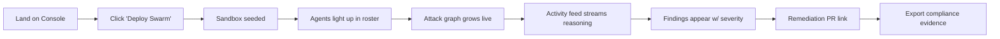

# BreachSim — UI/UX Design

A hackathon-winning, "ops console" aesthetic: dark, kinetic, and legible. The interface should
feel like watching a live cyber operation unfold.

---

## 1. Page list

| Page | Route | Purpose |
|------|-------|---------|
| **Console / Dashboard** | `/` | The hero surface — deploy swarm, watch live run |
| **Run history** | `/runs` | List of past runs + status |
| **Run detail** | `/runs/[id]` | Full attack graph, findings, evidence |
| **Compliance** | `/runs/[id]/compliance` | NIST/SOC2/ISO evidence export |
| **Settings** | `/settings` | Tenant consent, scope allow-list, frameworks |

> Hackathon MVP ships the **Console** as a single rich page that contains roster + graph + feed +
> findings (see [frontend/app/page.tsx](../frontend/app/page.tsx)).

---

## 2. User flow



Primary "demo" flow is a **single click → 90-second cinematic run**.

---

## 3. Wireframes (ASCII)

### Console
```
┌──────────────────────────────────────────────────────────────────────┐
│ 🛡 BreachSim · Agentic Red Team Swarm        Security in the Agentic..│
├──────────────────────────────────────────────────────────────────────┤
│ Continuous Red-Team Console            [ ▶ Deploy Swarm ]             │
│ ▰▰▰▰▰▰▱▱▱▱  60%                                                       │
├───────────┬───────────────────────────────┬──────────────────────────┤
│  SWARM    │      LIVE ATTACK GRAPH        │   AGENT ACTIVITY FEED     │
│ ┌───┬───┐ │       (Internet)              │ recon   12 resources, 1.. │
│ │Rec│Res│ │          │                    │ planner 3-step chain...   │
│ │Pln│Sec│ │      (blob ●)──reaches        │ security 3 approved...    │
│ │Exe│Val│ │          │                    │ execution downloaded...   │
│ │Rsk│Cmp│ │      (KeyVault ●)             │ risk    CVSS 9.1 critical │
│ │Rem│Mem│ │                               │ remediation PR opened...  │
│ └───┴───┘ │                               │                           │
├───────────┴───────────────────────────────┴──────────────────────────┤
│ ⚠ FINDINGS & REMEDIATION                                              │
│ Public blob → secrets exposure              [ CRITICAL ]              │
│ → Remediation PR opened (bicep)                                       │
└──────────────────────────────────────────────────────────────────────┘
```

---

## 4. Components

| Component | File | Notes |
|-----------|------|-------|
| `AgentRoster` | [AgentRoster.tsx](../frontend/components/AgentRoster.tsx) | 10 agents; active = cyan glow + pulse, done = green ✓ |
| `AttackGraph` | [AttackGraph.tsx](../frontend/components/AttackGraph.tsx) | D3 force layout; nodes colored by kind; edges weighted by confidence |
| `AgentFeed` | [AgentFeed.tsx](../frontend/components/AgentFeed.tsx) | Monospace stream; per-agent color coding |
| Progress bar | inline | Gradient cyan→red, eases on phase change |
| Findings panel | inline | Severity chips; remediation PR link |

---

## 5. Color system

| Token | Hex | Use |
|-------|-----|-----|
| `ink` | `#0A0E1A` | App background |
| `panel` | `#111726` | Cards / glass |
| `panelHi` | `#18203A` | Raised surfaces |
| `breach` | `#FF3B5C` | Attacker / critical / exploit edges |
| `signal` | `#00E5FF` | Active agent / discovery |
| `safe` | `#22D39A` | Remediation / validated / done |
| `warn` | `#FFB020` | Planning / medium risk |
| `muted` | `#7C8AA5` | Secondary text |

**Typography:** JetBrains Mono for the feed/graph (terminal feel); system sans for chrome.

**Motion principles:**
- Active agent **pulses** (`animate-pulseSoft`) and glows.
- Graph nodes **spring** in via D3 force simulation as recon/planner discover them.
- Progress bar **eases** between phases for a sense of momentum.
- Keep it **legible** — judges read the feed; don't over-animate.
