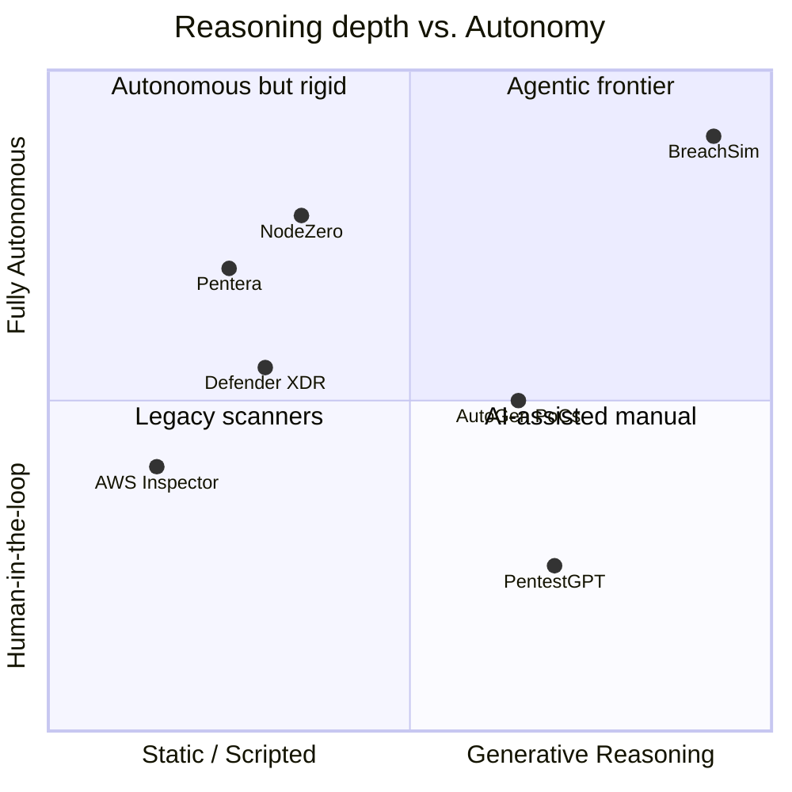

# BreachSim — Uniqueness Moat Report

> "Attackers don't sleep. Now neither does your red team."

This report establishes BreachSim's defensibility against the competitive landscape and codifies
the five differentiators that form its moat.

---

## 1. Competitive analysis

| Competitor | Type | Similarity | Key difference — why BreachSim wins |
|-----------|------|------------|-------------------------------------|
| **Pentera** | Commercial product | Automated pen-testing | Script-based exploitation engine. No LLM reasoning, no cross-agent collaboration, no natural-language attack planning. Can't adapt to novel configurations or generate human-readable threat narratives. |
| **NodeZero (Horizon3.ai)** | Commercial product | Autonomous pen-testing | Closest commercial analogue. Uses fixed attack-graph traversal, not generative reasoning. No multi-agent architecture. No real-time LLM-driven exploit chaining. $50K+/yr — no startup-friendly tier. |
| **HackerGPT / PentestGPT** | Open-source / research | LLM + security | Single-agent chat interface. Human-in-the-loop for every step. No autonomous multi-agent swarm. No real execution. No Azure integration. |
| **AutoGen + Metasploit wrappers** | GitHub / research | Agentic + hacking tools | Research PoCs only. No production architecture, no compliance reporting, no enterprise deployment, no real-time remediation. A polished product on Azure Foundry is a different category. |
| **Microsoft Defender XDR** | Platform | Azure security | Reactive detection, not proactive red-teaming. BreachSim is offensive simulation — a fundamentally different threat model. Complementary; extends the Azure ecosystem. |
| **AWS Inspector / GCP SCC** | Cloud-native | Cloud security scanning | Configuration scanning, not active exploitation simulation. No AI reasoning, no agent swarm, no exploit chaining. Orders of magnitude less sophisticated. |

### Positioning map

---

## 2. The five defensible moats

### Moat 1 — Reasoning-native attack planning
Every existing tool uses pre-built attack trees. BreachSim uses **Azure OpenAI GPT-4o** with
structured reasoning to dynamically compose attack chains from novel environmental context — it
discovers paths no rule set anticipated. Grounded by RAG over a CVE/ATT&CK vector index.

### Moat 2 — True multi-agent specialization
Not sequential LLM calls. Agents have **distinct roles, distinct tool access, and asynchronous
communication via Event Grid**. The Recon Agent has no access to the Execution Agent's tools, and
the Validator Agent can **veto** the Execution Agent — mirroring how elite red teams operate.

### Moat 3 — Compliance-native output
Every agent action is logged to an **immutable Cosmos DB audit trail** with NIST 800-53 / SOC 2 /
ISO 27001 control mappings. No existing red-team tool generates compliance evidence. A **$50K/yr
upsell** to every enterprise customer.

### Moat 4 — Azure-native deployment with zero infrastructure
Runs entirely in the target's existing Azure tenant via **Container Apps + Entra ID**. No agent
installation, no VPN, no on-prem footprint. This is what makes it demo-able in 90 seconds.

### Moat 5 — Remediation loop
After discovering a vulnerability, the **Remediation Agent** generates an Infrastructure-as-Code
fix (Bicep/Terraform) and opens a **GitHub PR**. No competitor closes the red-team → blue-team
loop automatically.

---

## 3. Defensibility summary

| Moat | Barrier type | Time-to-replicate for a competitor |
|------|-------------|-------------------------------------|
| Reasoning-native planning | Model + prompt engineering + RAG corpus | High |
| Multi-agent specialization | Architecture + orchestration | High |
| Compliance-native output | Domain expertise + control mapping data | Medium-High |
| Azure-native zero-infra | Deep platform integration | Medium |
| Remediation loop | Cross-domain (offense + IaC + DevOps) | High |

**Compounding moat:** every run enriches the shared **threat memory** (Cosmos DB). The longer a
customer runs BreachSim, the smarter its swarm becomes for *their* environment — a data network
effect competitors can't shortcut.

---

## 4. Why judges should care

- Hits the **"Security in the Agentic Future"** theme directly.
- Microsoft's $20B/yr security business makes this strategically resonant.
- The demo produces a **jaw-drop moment**: 5 agents autonomously discover, chain, and remediate a
  threat vector in under 2 minutes — entirely self-contained and controllable on stage.
